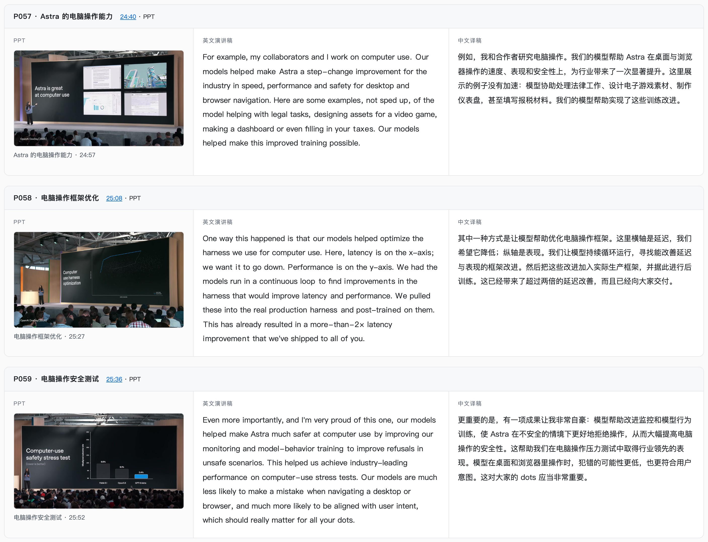

# 逐页 PPT 与演讲文字稿

`speech-transcript-organizer` 将发布会、课程和演讲整理为按现场顺序排列的 **PPT 图片＋对应文字稿**，方便快速阅读、回查原视频和保存资料。

可以从视频开始，也可以提供已有 PPT、字幕、速记稿或截图。英文视频默认逐页交付英文演讲稿和中文译稿；中文视频交付中文现场稿。当前版本：**1.8.2**。

## 在线示例

[打开 OpenAI DevDay 2026 中英图文阅读](https://keynotes-examples.pages.dev/)

完整整理约 53 分钟的来源视频，得到 107 个阅读单元，包含 111 张截图、英文演讲稿和中文译稿。每页的时间链接可回查[原视频](https://www.youtube.com/watch?v=Fls_onRviPM)，「对照改动」可查看英文整理前后的变化。

[](https://keynotes-examples.pages.dev/)

## 安装与使用

下载本仓库，保留 `SKILL.md`、`references/` 和 `scripts/` 的结构。在 Codex 中，默认安装位置为 `~/.codex/skills/speech-transcript-organizer/`；从下载后的仓库根目录执行：

```bash
mkdir -p ~/.codex/skills/speech-transcript-organizer
cp SKILL.md README.md ~/.codex/skills/speech-transcript-organizer/
cp -R references scripts ~/.codex/skills/speech-transcript-organizer/
```

自定义了 `CODEX_HOME` 时，使用该目录下的 `skills/`。其他 Agent 按各自的 Skill 安装方式导入。安装后开启新会话，提供材料并提出需求，例如：

> 用 speech-transcript-organizer 整理这个视频，给我按现场顺序排列的逐页 PPT 图片和对应文字稿。保留原意与有用信息；英文内容同时提供中文译稿。

执行流程见 [SKILL.md](SKILL.md)。

## 整理方式

- 保留原意、数字、案例、条件与现场顺序，按语义润句、补标点和分段。
- 优先复用可靠材料，按缺项补取文字或页面。
- 演示配音中的有用内容与现场解说分别标明。
- 交付可移动的 HTML 阅读目录与 Markdown 图文稿，支持查看文字改动。

## 使用条件

视频与图片任务需要图片读取能力，能读取页面中的文字、图表和布局变化。

文字整理工具使用 Python 3.10+；视频处理按需使用 ffmpeg/ffprobe，本地听写按需使用 whisper.cpp 和兼容模型。具体条件见 [前置检查](references/prerequisites.md)。

已在 Codex 和 Claude Code 上验证。

## 使用与免责声明

本 Skill 由作者原创，可自由使用、修改和分享。

本 Skill 面向学习、研究和资料整理。视频、音频、字幕、PPT 及相关内容的版权归原权利人所有。使用者应在合法授权或法律允许的范围内获取、处理和分享素材与整理结果，并按要求注明来源。使用者应对自己的素材使用和传播行为负责。
